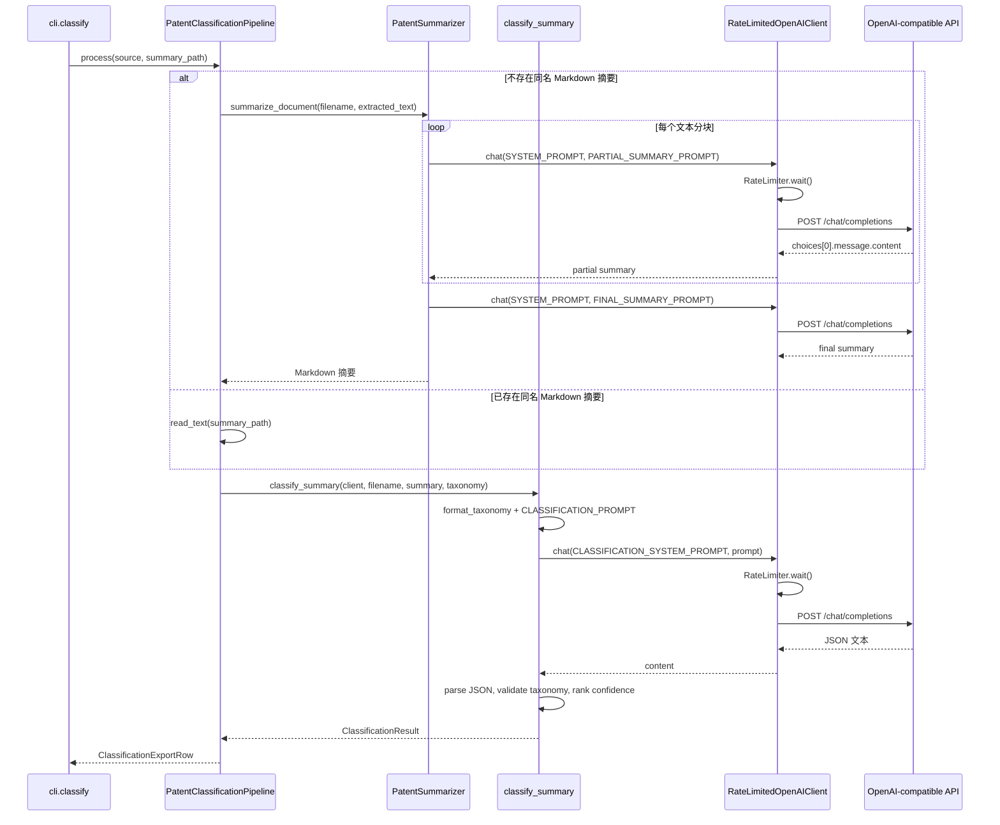

# 专利分类流程架构图

```mermaid
flowchart LR
    user["用户执行 CLI<br/>python -m patent_summarizer classify"] --> cli["cli.classify"]

    cli --> discover["discover_classification_documents<br/>扫描 PDF / DOCX"]
    cli --> taxonomy["load_taxonomy<br/>读取一级/二级分类表"]
    cli --> config["load_config<br/>读取 .env / API 参数"]
    config --> client["RateLimitedOpenAIClient<br/>限速、重试、超时"]

    discover --> loop["逐个文档处理"]
    taxonomy --> pipeline["PatentClassificationPipeline"]
    client --> pipeline
    loop --> checkpoint_check{"CheckpointStore<br/>是否已成功？"}

    checkpoint_check -- "是" --> reuse_row["复用历史结果行"]
    checkpoint_check -- "否" --> pipeline

    pipeline --> summary_check{"同名 .md 摘要<br/>是否存在？"}
    summary_check -- "是" --> read_summary["读取 Markdown 摘要"]
    summary_check -- "否" --> extract["TextExtractor.extract"]

    extract --> type_check{"文件类型"}
    type_check -- ".docx" --> pandoc["pandoc 转 Markdown"]
    type_check -- ".pdf" --> pdf_text["pdfplumber / pypdf<br/>必要时 OCR"]
    pandoc --> raw_text["原文文本"]
    pdf_text --> raw_text

    raw_text --> summarizer["PatentSummarizer"]
    summarizer --> split["split_text<br/>按 max_chars 分块"]
    split --> llm_summary["LLM 调用：摘要生成<br/>SYSTEM_PROMPT + PARTIAL/FINAL_SUMMARY_PROMPT"]
    llm_summary --> save_md["写入同名 .md 摘要"]
    save_md --> read_summary

    read_summary --> parse_sections["parse_summary_sections<br/>提取专利主题等章节"]
    read_summary --> classify_summary["classify_summary"]
    taxonomy --> format_taxonomy["format_taxonomy<br/>只给定允许分类"]
    format_taxonomy --> classify_prompt["CLASSIFICATION_PROMPT<br/>文件名 + 摘要 + 分类目录"]
    classify_summary --> classify_prompt

    classify_prompt --> llm_classify["LLM 调用：分类<br/>POST /chat/completions"]
    client --> llm_classify
    llm_classify --> llm_json["模型返回 JSON<br/>classifications[]"]
    llm_json --> parse_response["parse_classification_response"]

    parse_response --> validate["过滤非法分类<br/>只保留分类表中存在的二级分类"]
    validate --> rank["按 confidence 降序<br/>最多保留 max_candidates"]
    rank --> thresholds["阈值判断<br/>主分类 >= 0.45<br/>通过 >= 0.75"]
    thresholds --> row["ClassificationExportRow<br/>主分类、候选、理由、复核状态、摘要字段"]

    row --> checkpoint_success["CheckpointStore.record_success"]
    pipeline -. "异常" .-> checkpoint_fail["CheckpointStore.record_failure"]
    reuse_row --> rows["rows[]"]
    checkpoint_success --> rows
    checkpoint_fail --> rows

    rows --> excel["write_classification_workbook"]
    excel --> output["输出分类结果 .xlsx"]
```

## LLM 调用细节

```mermaid
sequenceDiagram
    participant CLI as cli.classify
    participant Pipe as PatentClassificationPipeline
    participant Sum as PatentSummarizer
    participant Cls as classify_summary
    participant Client as RateLimitedOpenAIClient
    participant API as OpenAI-compatible API

    CLI->>Pipe: process(source, summary_path)
    alt 不存在同名 Markdown 摘要
        Pipe->>Sum: summarize_document(filename, extracted_text)
        loop 每个文本分块
            Sum->>Client: chat(SYSTEM_PROMPT, PARTIAL_SUMMARY_PROMPT)
            Client->>Client: RateLimiter.wait()
            Client->>API: POST /chat/completions
            API-->>Client: choices[0].message.content
            Client-->>Sum: partial summary
        end
        Sum->>Client: chat(SYSTEM_PROMPT, FINAL_SUMMARY_PROMPT)
        Client->>API: POST /chat/completions
        API-->>Client: final summary
        Sum-->>Pipe: Markdown 摘要
    else 已存在同名 Markdown 摘要
        Pipe->>Pipe: read_text(summary_path)
    end

    Pipe->>Cls: classify_summary(client, filename, summary, taxonomy)
    Cls->>Cls: format_taxonomy + CLASSIFICATION_PROMPT
    Cls->>Client: chat(CLASSIFICATION_SYSTEM_PROMPT, prompt)
    Client->>Client: RateLimiter.wait()
    Client->>API: POST /chat/completions
    API-->>Client: JSON 文本
    Client-->>Cls: content
    Cls->>Cls: parse JSON, validate taxonomy, rank confidence
    Cls-->>Pipe: ClassificationResult
    Pipe-->>CLI: ClassificationExportRow
```
